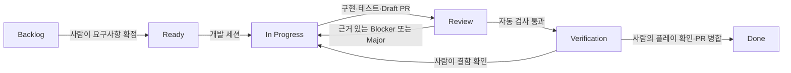

# SASHIMI BOY 이슈 기반 개발·검증 운영

이 안내는 실행기 설치와 파일럿 검증이 끝난 뒤의 운영 기준입니다.
현재 설치 준비 상태는 [수정 보고서](../HostAutomation/REVIEW_REPAIR_20260917.md)를
확인합니다. 아직 중지된 예약 작업을 이 문서만 보고 재개하지 않습니다.



## 이슈를 Ready로 보내기 전에

아래 내용을 이슈 본문에 적습니다. 시각·스토리·밸런스 결정을 AI가 추측하게
두지 않고, 범위가 작고 완료 기준이 분명한 작업부터 시작합니다.

```text
목표: 사용자가 어떤 상황에서 어떤 동작을 할 수 있어야 하는가?
변경 범위: 대상 화면·기능·파일·에셋
제외 범위: 이번 작업에서 변경하지 않을 것
완료 기준: 입력/상황 → 관찰 가능한 예상 결과
자동 확인: 재현 절차, 테스트로 확인할 결과
사람 확인: 화면·카메라·소리·조작감에서 직접 볼 항목
준비된 자료: 필요한 원본 에셋·설정·참고 이미지의 위치
```

사람이 `Backlog → Ready`로 바꾸면 실행기가 우선순위에 따라 한 이슈만
선택합니다. 기존 PR의 수정·재검증은 그 PR과 브랜치를 이어 사용합니다.

## 검토 결과를 읽는 기준

| 결과 | 처리 |
| --- | --- |
| 현재 완료 기준을 위반하는 결함과 구체적인 코드 경로/재현 증거 | 개발 세션에 수정 요청, `In Progress` |
| 자동 검사는 통과했고 카메라 느낌·음악 싱크·연출 등의 사람 확인이 남음 | 체크리스트와 함께 `Verification` |
| 라이선스·권한·프로세스 잠금 등으로 필수 검사가 실행되지 못함 | `Review` 유지, 실행 환경 문제로 기록 |
| 필수 기준에 대한 증거가 부족함 | `Review` 유지, 부족한 증거를 명시 |
| 선택적인 개선 제안 | 새로운 필수 요구사항이나 반려 사유로 취급하지 않음 |

AI 검토자가 실행하지 않은 테스트를 PASS라고 적어서는 안 됩니다.
반대로 사람 확인이 남아 있다는 이유만으로 게임 코드가 잘못됐다고
판정해서도 안 됩니다. 실제로 재현된 시각적 결함은 수정 대상입니다.

## 사람의 최종 확인

`Verification`의 PR 체크리스트대로 게임을 실행하고, 확인한 빌드/커밋과
화면·영상 등 요청된 증거를 남깁니다. 통과하면 사람이 PR을 병합하고
이슈 종료와 `Done`을 확인합니다.

실패하면 실제 입력·예상 결과·관찰 결과를 남깁니다. 기존 PR을 다시 개발
세션에 넘길 때는 현재 PR head를 가리키는 Owner `ReviewFix` handoff가
필요합니다. 상태만 `In Progress`로 바꾸면 자동 재진입하지 않습니다.
정확한 형식과 생성 도구는 [WORKFLOW.md](WORKFLOW.md)의 handoff 규칙을
따릅니다.

불필요한 반려가 의심되면 검토자가 인용한 완료 기준과 증거를 먼저 봅니다.
기준이 모호했다면 이슈의 최신 Owner Decision과 완료 기준에 의도를
명확히 적습니다. 기존 검토자의 취향이 새 요구사항이 되지 않도록 합니다.
